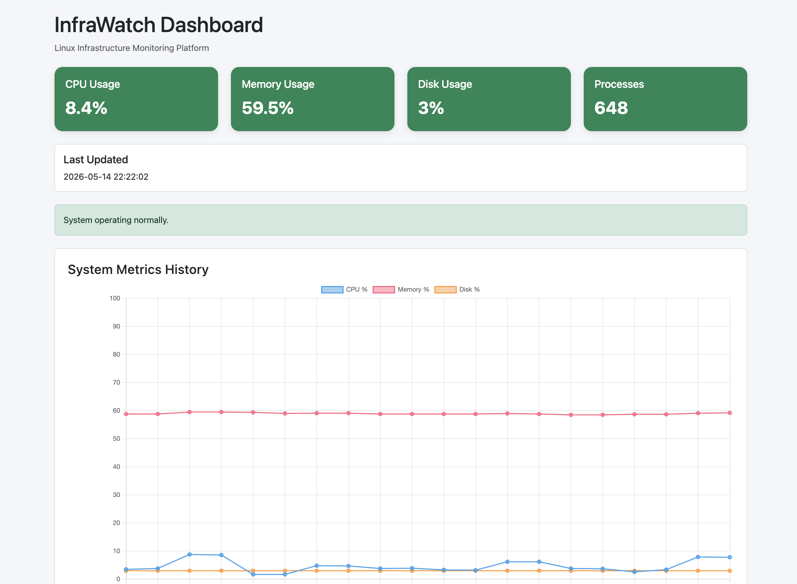
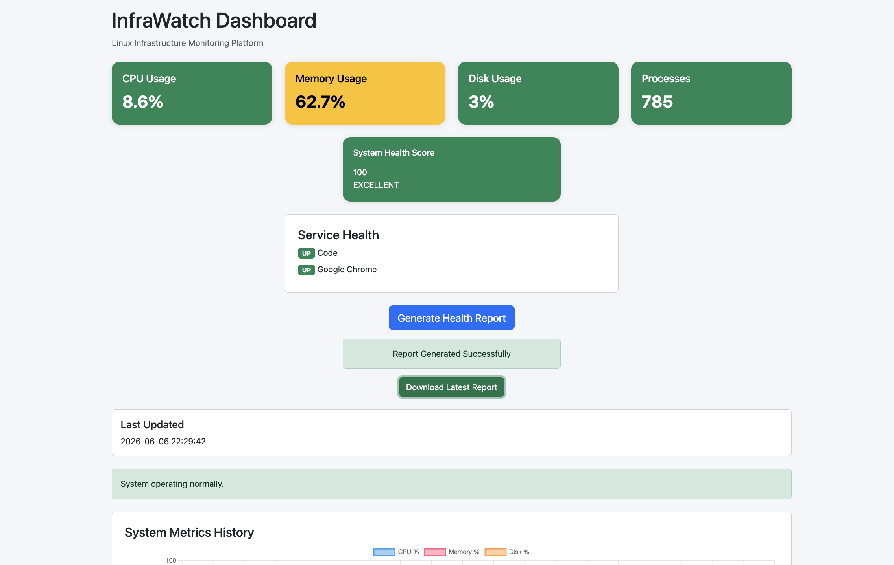

# InfraWatch – Infrastructure Monitoring & Alerting Platform

InfraWatch is a lightweight infrastructure monitoring and observability platform built using Python, Flask, SQLite, and psutil.

The platform continuously collects system telemetry, monitors service health, stores historical metrics, visualizes infrastructure status through dashboards, generates alerts, calculates health scores, and produces downloadable infrastructure health reports.

---

## Features

### Infrastructure Monitoring

- Real-time CPU monitoring
- Real-time memory monitoring
- Real-time disk utilization monitoring
- Process count monitoring
- Auto-refreshing operational dashboard

### Observability & Visualization

- Flask-based REST APIs
- Historical metrics storage using SQLite
- Historical trend visualization using Chart.js
- Live dashboard with health indicators
- Infrastructure health score calculation

### Alerting & Reliability

- Threshold-based alerting
- Alert logging workflows
- Service health watchdog monitoring
- Service UP/DOWN state tracking
- Service status dashboard panel

### Reporting & Automation

- Automated infrastructure health report generation
- Dashboard-triggered report generation
- Downloadable health reports
- Historical metric analysis
- Operational health summaries

---

## Tech Stack

- Python
- Flask
- SQLite
- APScheduler
- psutil
- Bootstrap
- Chart.js

---

## Project Architecture

```text
System Metrics
      ↓
psutil Collector
      ↓
Background Scheduler
      ↓
SQLite Storage
      ↓
Flask REST APIs
      ↓
Dashboard & Charts
      ↓
Alerts / Health Score / Reports
```

### Service Monitoring Flow

```text
Service Watchdog
      ↓
Process Discovery
      ↓
Service Status Tracking
      ↓
UP / DOWN Detection
      ↓
Dashboard Visibility
      ↓
Operational Alerts
```

---

## API Endpoints

### Live Metrics

```bash
/api/metrics
```

Returns current infrastructure telemetry and health score.

### Historical Metrics

```bash
/api/history
```

Returns historical metrics for dashboard visualization.

### Service Health

```bash
/api/services
```

Returns monitored service status information.

### Generate Health Report

```bash
/api/generate-report
```

Generates an infrastructure health report.

### Download Health Report

```bash
/api/download-report
```

Downloads the latest generated infrastructure report.

---

## Dashboard Capabilities

- Infrastructure health monitoring
- Health score visualization
- Service availability monitoring
- Alert visibility
- Historical trend analysis
- Report generation
- Report download

---

## Setup Instructions

### Clone Repository

```bash
git clone <your-repository-url>
cd InfraWatch
```

### Create Virtual Environment

```bash
python3 -m venv .venv
source .venv/bin/activate
```

### Install Dependencies

```bash
pip install -r requirements.txt
```

### Run Application

```bash
python3 app.py
```

Open:

```bash
http://127.0.0.1:5000
```

---

## Project Structure

```text
InfraWatch/
│
├── app.py
├── metrics_collector.py
├── db.py
├── service_watchdog.py
├── report_generator.py
│
├── templates/
│   └── dashboard.html
│
├── reports/
│   └── health_report_YYYY-MM-DD.txt
│
├── logs/
│   └── service_watchdog.log
│
├── data/
│   └── metrics.db
│
├── tests/
│   └── test_watchdog.py
│
└── requirements.txt
```

---

## Key Learning Outcomes

- Infrastructure monitoring fundamentals
- Observability and telemetry collection
- Service health monitoring
- Flask API development
- SQLite data persistence
- Dashboard development
- Alerting systems
- Automation workflows
- Report generation pipelines
- Reliability engineering concepts

---

## Future Improvements

- Docker containerization
- Multi-node monitoring
- Network monitoring
- Email alert notifications
- Prometheus integration
- Grafana dashboards
- Kubernetes monitoring
- Role-based access control

---

## Dashboard Preview







---
